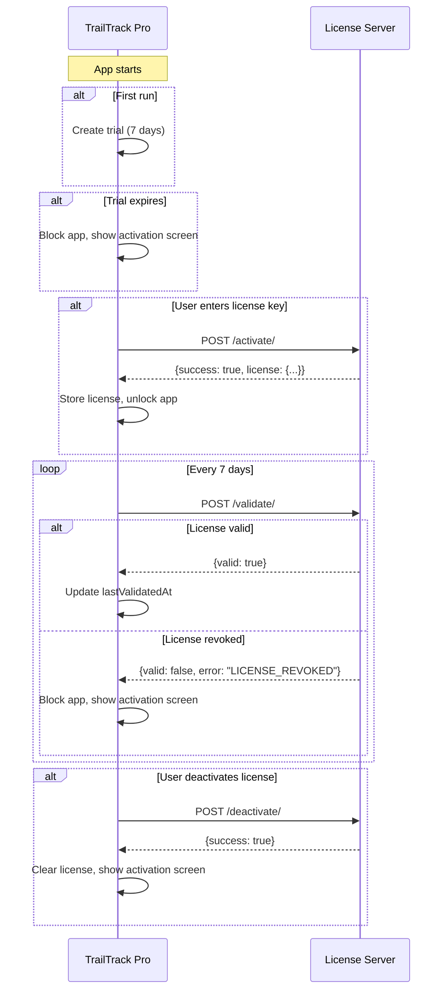

# Django License Server API Specification

This document describes the API endpoints that the TrailTrack Pro Electron application expects from the Django License Server.

---

## Overview

TrailTrack Pro uses a license-key based activation system with:
- **7-day free trial** (managed locally in the app)
- **License activation** requiring server validation
- **Periodic revalidation** every 7 days to check license status
- **License deactivation** to allow machine transfers

### Server URL

The app expects the license server at:
```
https://trailtrack.app/api/license
```

This can be overridden via the `LICENSE_SERVER_URL` environment variable.

---

## API Endpoints

### 1. Activate License

Activates a license key on a specific machine.

**Endpoint:** `POST /activate/`

**Request Headers:**
```
Content-Type: application/json
```

**Request Body:**
```json
{
    "license_key": "550e8400-e29b-41d4-a716-446655440000",
    "machine_id": "abc123def456...",
    "app_version": "1.0.0",
    "platform": "linux"
}
```

| Field | Type | Description |
|-------|------|-------------|
| `license_key` | string | The license key entered by the user (UUID format) |
| `machine_id` | string | SHA256 hash of hostname, truncated to 32 characters |
| `app_version` | string | Version of the TrailTrack Pro app |
| `platform` | string | OS platform (`win32`, `darwin`, `linux`) |

**Success Response (HTTP 200):**
```json
{
    "success": true,
    "license": {
        "email": "customer@example.com"
    }
}
```

**Error Response (HTTP 200 with success=false):**
```json
{
    "success": false,
    "error": "ERROR_CODE",
    "message": "Human-readable error message"
}
```

**Possible Error Codes:**
| Error Code | Description |
|------------|-------------|
| `INVALID_KEY` | License key format is invalid or doesn't exist |
| `ALREADY_ACTIVATED` | License is already activated on another machine |
| `EXPIRED` | License has expired |
| `MAX_ACTIVATIONS` | Maximum activation limit reached |

---

### 2. Validate License

Validates an existing license activation. Called silently every 7 days.

**Endpoint:** `POST /validate/`

**Request Headers:**
```
Content-Type: application/json
```

**Request Body:**
```json
{
    "license_key": "550e8400-e29b-41d4-a716-446655440000",
    "machine_id": "abc123def456..."
}
```

| Field | Type | Description |
|-------|------|-------------|
| `license_key` | string | The activated license key |
| `machine_id` | string | SHA256 hash of hostname, truncated to 32 characters |

**Valid License Response (HTTP 200):**
```json
{
    "valid": true
}
```

**Revoked License Response (HTTP 200):**
```json
{
    "valid": false,
    "error": "LICENSE_REVOKED"
}
```

**Other Invalid Response (HTTP 200):**
```json
{
    "valid": false,
    "error": "ERROR_CODE",
    "message": "Human-readable reason"
}
```

> **Important:** When the server returns `"error": "LICENSE_REVOKED"`, the app will immediately block the user and require a new license key.

---

### 3. Deactivate License

Deactivates a license from the current machine, allowing transfer to another device.

**Endpoint:** `POST /deactivate/`

**Request Headers:**
```
Content-Type: application/json
```

**Request Body:**
```json
{
    "license_key": "550e8400-e29b-41d4-a716-446655440000",
    "machine_id": "abc123def456..."
}
```

| Field | Type | Description |
|-------|------|-------------|
| `license_key` | string | The license key to deactivate |
| `machine_id` | string | Machine ID that was used during activation |

**Success Response (HTTP 200):**
```json
{
    "success": true
}
```

**Error Response (HTTP 200):**
```json
{
    "success": false,
    "message": "Human-readable error message"
}
```

---

## Data Model Reference

The Django server should maintain a license model similar to:

```python
class License(models.Model):
    """
    Represents a software license.
    """
    key = models.UUIDField(unique=True, default=uuid.uuid4)
    email = models.EmailField()
    
    # Activation tracking
    machine_id = models.CharField(max_length=64, blank=True, null=True)
    activated_at = models.DateTimeField(blank=True, null=True)
    last_validated_at = models.DateTimeField(blank=True, null=True)
    
    # Status
    is_revoked = models.BooleanField(default=False)
    max_activations = models.IntegerField(default=1)
    current_activations = models.IntegerField(default=0)
    
    # Metadata
    created_at = models.DateTimeField(auto_now_add=True)
    expires_at = models.DateTimeField(blank=True, null=True)  # Optional expiry


class LicenseActivation(models.Model):
    """
    Tracks individual machine activations for a license.
    Useful if supporting multiple activations per license.
    """
    license = models.ForeignKey(License, on_delete=models.CASCADE)
    machine_id = models.CharField(max_length=64)
    app_version = models.CharField(max_length=20)
    platform = models.CharField(max_length=20)  # win32, darwin, linux
    activated_at = models.DateTimeField(auto_now_add=True)
    last_seen_at = models.DateTimeField(auto_now=True)
    is_active = models.BooleanField(default=True)
```

---

## Machine ID Generation

The client generates the `machine_id` using:

```javascript
const machineId = crypto
    .createHash('sha256')
    .update(os.hostname())
    .digest('hex')
    .substring(0, 32);
```

This is a **32-character hex string** derived from the machine's hostname.

> **Note:** Using hostname alone means the machine ID could change if the user renames their computer. Consider this for support scenarios.

---

## License Key Format

License keys are standard UUIDs:
```
550e8400-e29b-41d4-a716-446655440000
```

The input field accepts lowercase UUIDs.

---

## Behavior Summary



---

## Error Handling

The app handles network errors gracefully:

| Scenario | App Behavior |
|----------|--------------|
| Activation fails (network) | Shows "Could not connect to license server" |
| Validation fails (network) | **Silently ignores** - continues using cached state |
| Deactivation fails (network) | Shows "Could not connect to license server" |

> **Tip:** The app is offline-tolerant for validation. Only activation and deactivation require connectivity.

---

## Testing Considerations

For development/testing, set the environment variable:
```bash
LICENSE_SERVER_URL=http://localhost:8000/api/license
```

Recommended test cases:
1. Valid license key → successful activation
2. Invalid/non-existent key → error response
3. Already-activated license → appropriate error
4. Revoke a license in admin → app should block on next validation
5. Deactivate → license should be available for reactivation
6. Network timeout during activation → graceful error
7. Network timeout during validation → silent failure, app continues
